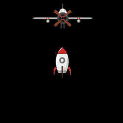

 &nbsp;&nbsp;&nbsp;&nbsp;&nbsp;&nbsp;&nbsp;&nbsp;&nbsp;&nbsp; [ reply.it](https://repl.it/repls/folder/PyGame%20Examples)

---

# PyGame Examples and Answers

"We learn more by looking for the answer to a question and not finding it than we do from learning the answer itself."  
Lloyd Alexander, The Book of Three

<!--
--><!--
--><!--
--><!--
--><!--
--><!--
--><!--
--><!--
--><!--
--><!--
--><!--
--><!--
--><!--
--><!--
--><!--
--><!--
--><!--
--><!--
--><!--
--><!--
--><!--
--><!--
--><!--
--><!--
-->

This repository is an excerpt and explanations of answers to [PyGame](https://www.pygame.org/news) questions published on [Stack Overflow](https://stackoverflow.com/questions/tagged/pygame) and answered by the author of this repository.  
It does not contain an application, just a collection of examples. Initially I just wanted to bring order to a bunch of PyGame examples on my local drive. The examples should not be sophisticated, they should be kept as simple as possible. Each example should just spot one single issue. However, this is not a complete PyGame tutorial, but rather a FAQ.  
This page provides links to the relevant Stack Overflow questions and live examples on [repl.it](https://repl.it/). The examples are roughly divided into topics. My first language isn't English, but I did my best. I struggle with English grammar, which is the bill of my laziness at school.  
The site is still under construction :construction:.

## PyGame

[PyGame](https://www.pygame.org/news)  
[PyGame documentation](https://www.pygame.org/docs/)

[PyGame](https://www.pygame.org/news) examples and explanations.

### Application, control flow and events

[Event and application loop](documentation/pygame/pygame_event_and_application_loop.md)

[Display, display position, update, resize, coordinate system and scroll](documentation/pygame/pygame_display_resize_and_scroll.md)

[Keys and keyboard events](documentation/pygame/pygame_keys_and_keyboard_event.md)

[Mouse and mouse events](documentation/pygame/pygame_mouse_and_mosuse_events.md)

[Joystick](documentation/pygame/pygame_joystick.md)

[Time, timer event and clock](documentation/pygame/pygame_time_and_timer_event.md)

[Music and sound](documentation/pygame/pygame_music_and_sound.md)

### Draw scene

[Color](documentation/pygame/pygame_color.md)

[Rectangle](documentation/pygame/pygame_rectangle.md)

[Surface and Image](documentation/pygame/pygame_surface_and_image.md)

[Text and font](documentation/pygame/pygame_text_and_font.md)

[Draw shape and contour](documentation/pygame/pygame_draw_shape_and_contour.md)

[Mask](documentation/pygame/pygame_mask.md)

[Blending and transparency](documentation/pygame/pygame_blending_and_transaprency.md)

[Clipping](documentation/pygame/pygame_clipping.md)

[Sprite, Group, Sprite collision and Sprite mask](documentation/pygame/pygame_sprite_and_sprite_mask.md)

### Move, scale and rotate objects

[Scale surface](documentation/pygame/pygame_surface_scale.md)

[Rotate surface](documentation/pygame/pygame_surface_rotate.md)

[Zoom surface](documentation/pygame/pygame_surface_zoom.md)

[Rotate towards target or mouse](documentation/pygame/pygame_rotate_towards_target.md)

[Move towards target or mouse](documentation/pygame/pygame_move_towards_target.md)

[Motion and movement](documentation/pygame/pygame_movement_and_motion.md)

### Interaction between objects

[Vector](documentation/pygame/pygame_vector_and_reflection.md)

[Collision and Intersection (Bounce, Pong, etc.)](documentation/pygame/pygame_collision_and_intesection.md)

[Random and random distribution](documentation/pygame/pygame_random_and_random_distribution.md)

[Random movement](documentation/pygame/pygame_random_movement.md)

### Enhanced

[Surface array, pixel array, buffer proxy](documentation/pygame/pygame_surfacearray_pixelarray_and_bufferproxy.md)

[Threading](documentation/pygame/pygame_threading.md)

[Camera and Video](documentation/pygame/pygame_camera_and_video.md)

[Snake](documentation/pygame/pygame_snake.md)

[Draw 3D](documentation/pygame/pygame_3D.md)

[Miscellaneous](documentation/pygame/pygame_miscellaneous.md)

## Libraries

[Libraries based on PyGame](documentation/pygame/pygame_dependent_libraries.md)

[PyGame in combination with other libraries](documentation/pygame/pygame_and_othere_libraries.md)

## PyGame and OpenGL

[PyGame and OpenGL site map](documentation/pygame_opengl/pygame_opengl__site_map.md)

## PyGame Ray Tracing

See [PyGame Ray Tracing](https://github.com/Rabbid76/PyGameRayTracing) repository.
