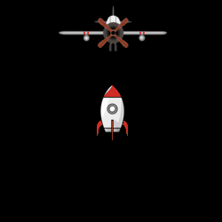

 &nbsp;&nbsp;&nbsp;&nbsp;&nbsp;&nbsp;&nbsp;&nbsp;&nbsp;&nbsp; [ reply.it](https://repl.it/repls/folder/PyGame%20Examples)

"The only way to go fast, is to go well."  
Robert C. Martin, Clean Architecture

---

# Mask

## Surface mask

Related Stack Overflow questions:

- [PyGame collision with masks is not working](https://stackoverflow.com/questions/57455811/pygame-collision-with-masks-is-not-working/57499484#57499484)
- [Collision between masks in PyGame](https://stackoverflow.com/questions/55817422/collision-between-masks-in-pygame/55818093#55818093)  
  

  :scroll: **[Minimal example - Find intersection of surfaces](../../examples/minimal_examples/pygame_minimal_mask_intersect_surface.py)**

  <kbd>[ repl.it/@Rabbid76/PyGame-SurfaceMaskIntersect](https://repl.it/@Rabbid76/PyGame-SurfaceMaskIntersect#main.py)</kbd>

- [Check collision between a image and a line](https://stackoverflow.com/questions/58662215/check-collision-between-a-image-and-a-line-pygame/58662648#58662648)  
  

  :scroll: **[Minimal example - Find intersection of surfaces and line](../../examples/minimal_examples/pygame_minimal_mask_intersect_surface_line_1.py)**

  <kbd>[ repl.it/@Rabbid76/PyGame-PyGame-SurfaceLineMaskIntersect-1](https://repl.it/@Rabbid76/PyGame-SurfaceLineMaskIntersect-1#main.py)</kbd>

- **[Overlap between mask and fired beams in PyGame [AI car model vision]](https://stackoverflow.com/questions/62008457/overlap-between-mask-and-fired-beams-in-pygame-ai-car-model-vision/62082726#62082726)**  
    

  :scroll: **[Minimal example - Find intersection of surface and lines](../../examples/minimal_examples/pygame_minimal_mask_intersect_surface_line_2.py)**

  <kbd>[ repl.it/@Rabbid76/PyGame-PyGame-SurfaceLineMaskIntersect-2](https://repl.it/@Rabbid76/PyGame-SurfaceLineMaskIntersect-2#main.py)</kbd>

- [How can I rotate my hit box with my rotating and moving car in PyGame?](https://stackoverflow.com/questions/62974678/how-can-i-rotate-my-hitbox-with-my-rotating-and-moving-car-in-pygame/62976825#62976825)

- [How can I rotate my hitbox with my rotating and moving car in pygame?](https://stackoverflow.com/questions/62974678/how-can-i-rotate-my-hitbox-with-my-rotating-and-moving-car-in-pygame/62976825#62976825)

- [python pygame mask collision](https://stackoverflow.com/questions/59595874/python-pygame-mask-collision/59598297#59598297)  
  

- [Get the pixels which are colliding with the Surface](https://stackoverflow.com/questions/20715211/get-the-pixels-which-are-colliding-with-the-surface/65408358#65408358)

## Circular maks

Related Stack Overflow questions:

- [pygame: mask non-image type surfaces](https://stackoverflow.com/questions/65455888/pygame-mask-non-image-type-surfaces/65455939#65455939)
## Mask bounding area rectangle

Related Stack Overflow questions:

- [How to get the correct dimensions for a pygame rectangle created from an image](https://stackoverflow.com/questions/65361582/how-to-get-the-correct-dimensions-for-a-pygame-rectangle-created-from-an-image/65361896#65361896)  
  

  :scroll: **[Minimal example - Find bounding area rectangle](../../examples/minimal_examples/pygame_minimal_mask_bounding_area_rectangle.py)**

## Sprite mask

See [Sprite, Group and Sprite mask - Sprite mask](pygame_sprite_and_sprite_mask.md)